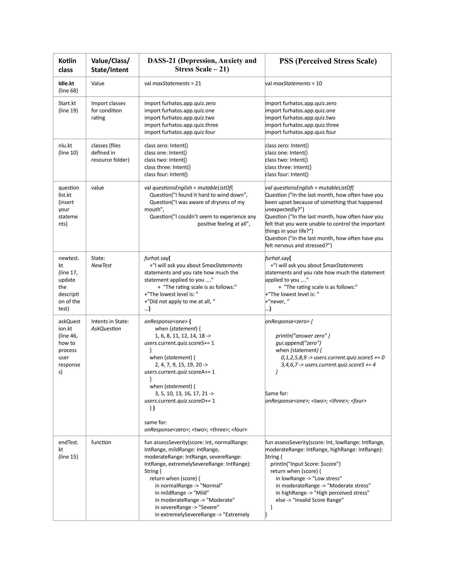
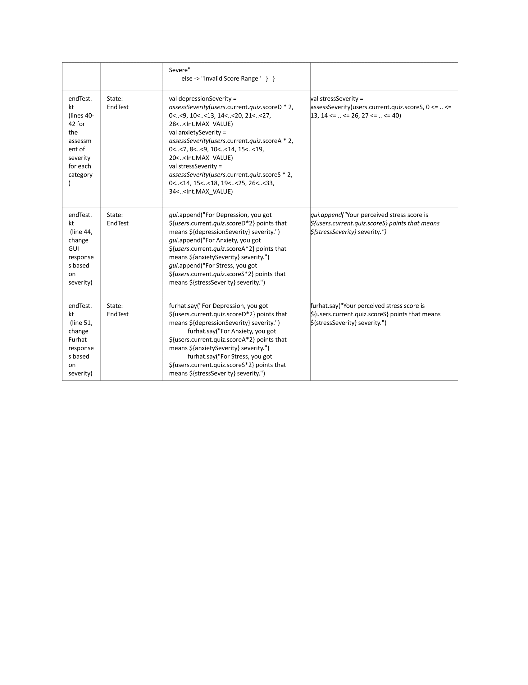

## Description
If you are facing significant emotional difficulties, you can use this open template to conduct a psychological interview with Furhat. Assess your results by filling out the Depression, Anxiety and Stress Scale - 21 Items (DASS-21). This set of three self-report scales is designed to measure emotional states, including depression, anxiety and stress.

## Usage
This Furhat Kotlin Skill is based on the skill template 'Quiz'. New Kotlin files are inserted, some are deleted. A Resources folder is included, as well as the Furhat default HostedGUI template for external touch monitor or tablet.
Max number of users is set to: 1

If you want to use external GUI, open on a tablet or other PC with Internet connection the furhat web page and press the GUI tab next to the skill. Start GUI at the begining.
You can change the name of the GUI in the 'main.kt', raw 9.

## Customisation
The test (DASS-21) can be customized, allowing changes to be made to any psychological test, including the number of statements, answer options, scale, and other parameters.

1. Customizing the Number of Statements:
Open the project and go to 'idle.kt', raw 68.
Change the variable val maxStatements = 21 to the number of statements in your customized test.

2. Changing the Test Description:
In 'newTest.kt', raw 17, update the description of the test.

3. Inserting Statements with Alternatives:
Go to 'questionlist.kt' to insert your statements with the alternatives. You can add or remove Question constructors.

4. Handling Correct Answers:
The correct answer is taken from the resources folder. Check 'nlu.kt', raw 10 for more details: Defining EnumEntities in separate files, https://docs.furhat.io/unstable/nlu/

5. Processing User Responses:
User responses are processed in 'askQuestion.kt', for instance, raw 60 processes onResponse<one> and assigns 1 point to the appropriate score (depression, anxiety, or stress) based on the statement.

6. Assessing Severity:
In 'endTest'.kt, raw 15, you need to change the function assessSeverity with your own assessment. Also, review rows 40-42 for the assessment of severity for each category.

## Customisation for DASS-42
This includes the number of statements, answer options, scale and assessment. Customizing the Number of Statements: Open the project and go to 'idle.kt', line 68. Change the variable val maxStatements = 21 to the number of statements in your customized test. In the start.kt define how many states you have and correspondingly how many state_scores you need. There are three scores in the template (scoreS, scoreA and scoreD). Exclude any scores you don't require, specifically, the scores that are unnecessary for your use case. Changing the Test Description: In 'newTest.kt', line 17, update the description of the test. Inserting Statements with Alternatives: Go to 'questionlist.kt' to insert your statements with the alternatives. You can add or remove Question constructors. Handling Correct Answers: The correct answer is taken from the resources folder. Check 'nlu.kt', line 10. Processing User Responses: User responses are processed in 'askQuestion.kt', for instance, line 60 processes onResponse and assigns 1 point to the appropriate score (depression, anxiety, or stress) based on the statement. Assessing Severity: In 'endTest'.kt, line 15, you need to change the function assessSeverity with your own assessment. Also, review lines 40-42 for the assessment of severity for each category.

## Customisation for PSS
The Perceived Stress Scale (PSS) is detailed in reference: S. Cohen, T. Kamarck, and R. Mermelstein, “A Global Measure of Perceived Stress,” *Journal of Health and Social Behavior*, vol. 24, no. 4, pp. 385–396, Dec. 1983. 
Adjusting the Number of Statements: Open the project and navigate to 'idle.kt' at line 68. Modify the variable val maxStatements = 10 to reflect the number of statements in your personalised test. In the start.kt define the state, which is stress, and how many state_scores you need. Individual scores on the PSS can range from 0 to 40 with higher scores indicating higher perceived stress. Updating the Test Description: In 'newTest.kt' at line 17, modify the test description. Adding Statements with Alternatives: Navigate to 'questionlist.kt' to insert your statements along with their alternatives, which can be never, almost never, sometimes, often and very often. Managing Correct Answers: The correct answer is sourced from the resources folder. Refer to 'nlu.kt' at line 10. The scores vary from 0 to 4 according to the alternatives. However, questions 4, 5, 7 and 8 are reversed. For evaluating Severity: in the 'endTest.kt' at line 15, replace the function assessSeverity with the assessment method. In this case there are three ranges for stress - low, moderate and high perceived stress.

